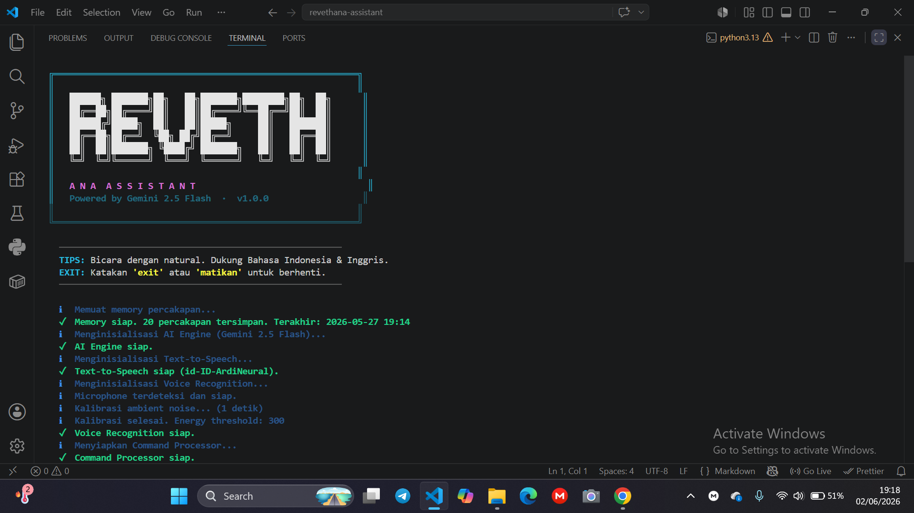

# 🤖 REVETHANA ASSISTANT

> Modern AI Desktop Assistant powered by Gemini 2.5 Flash
> Kontrol komputer Windows dengan suara — layaknya Jarvis

---



## ✨ Fitur

| Kategori | Kemampuan |
|---|---|
| 🎙️ Voice | Realtime microphone listening, STT Indonesian/English |
| 🧠 AI | Gemini 2.5 Flash conversation, memory percakapan |
| 🔊 TTS | edge-tts suara natural Indonesia (id-ID-ArdiNeural) |
| 🖥️ Aplikasi | Buka/tutup Discord, VSCode, Steam, Spotify, dll |
| 🌐 Browser | Buka YouTube, GitHub, Google, ChatGPT, dll |
| 🔍 Search | Cari video di YouTube, cari di Google |
| 📁 File | Buka folder Downloads, Documents, Drive D/E |
| 🔧 Sistem | Volume, screenshot, baterai, CPU/RAM, waktu |
| ⚡ Power | Shutdown, restart, sleep komputer |

---

## 📁 Struktur Project

```
revethana-assistant/
├── main.py           ← Entry point utama
├── ai.py             ← Gemini AI integration
├── voice.py          ← Speech recognition (mic → teks)
├── speak.py          ← Text-to-speech (edge-tts)
├── commands.py       ← Command detection & routing
├── system_control.py ← Windows system controller
├── memory.py         ← Conversation memory manager
├── memory.json       ← File penyimpanan memory
├── utils.py          ← Terminal UI & animations
├── requirements.txt  ← Python dependencies
└── .env              ← API key & config
```

---

## ⚙️ Setup & Instalasi

### 1. Prasyarat

- Python 3.9 atau lebih baru
- Windows 10/11 (dioptimalkan untuk Ryzen 5 3500U)
- Koneksi internet (untuk Gemini API & Google STT)
- Microphone yang terhubung

### 2. Dapatkan Gemini API Key (GRATIS)

1. Buka: https://aistudio.google.com/app/apikey
2. Login dengan akun Google
3. Klik **"Create API Key"**
4. Copy API key yang muncul

### 3. Setup Project

```bash
# Clone atau extract project ke folder pilihan
cd revethana-assistant

# Buat virtual environment (opsional tapi direkomendasikan)
python -m venv venv
venv\Scripts\activate

# Install dependencies
pip install -r requirements.txt
```

### 4. Install PyAudio (Windows — sering tricky)

```bash
# Cara termudah - pakai pipwin
pip install pipwin
pipwin install pyaudio
```

Jika masih gagal, download wheel dari:
https://www.lfd.uci.edu/~gohlke/pythonlibs/#pyaudio

```bash
# Sesuaikan nama file dengan versi Python kamu
pip install PyAudio-0.2.14-cp311-cp311-win_amd64.whl
```

### 5. Konfigurasi .env

Edit file `.env`:
```
GEMINI_API_KEY=api_key_kamu_disini
```

### 6. Jalankan!

```bash
python main.py
```

---

## 🗣️ Contoh Perintah

### Buka Aplikasi
```
"buka discord"
"bukain vscode dong"
"tolong buka spotify"
"jalanin steam"
"coba buka chrome"
```

### Buka Website
```
"buka youtube"
"buka github"
"bukain chatgpt dong"
"buka google"
```

### YouTube Search
```
"cari video minecraft di youtube"
"cariin lagu lofi di youtube"
"search tutorial python di youtube"
```

### Sistem
```
"jam berapa sekarang"
"battery laptop berapa persen"
"berapa cpu dan ram sekarang"
"screenshot layar"
"lihat screenshot terakhir"
```

### Volume
```
"volume naik"
"pelanin suaranya"
"mute"
"volume turun"
```

### Power
```
"shutdown komputer"
"restart laptop"
"sleep komputer"
```

### File & Folder
```
"buka folder download"
"buka folder dokumen"
"buka drive D"
"buka desktop"
```

### Tutup Aplikasi
```
"tutup chrome"
"matiin discord"
"close spotify"
```

### AI Conversation
```
"siapa presiden pertama indonesia"
"jelaskan apa itu black hole"
"buatkan contoh kode python sederhana"
"apa rekomendasi laptop gaming budget 10 juta"
```

---

## 🔧 Konfigurasi Lanjut

Edit bagian berikut di file masing-masing:

**Ganti suara TTS** (speak.py):
```python
PRIMARY_VOICE = "id-ID-GadisNeural"   # Ganti ke suara wanita
```

**Tambah aplikasi baru** (system_control.py):
```python
APP_REGISTRY["nama_app"] = [
    ("executable.exe", r"C:\path\ke\app.exe", None),
]
```

**Tambah website baru** (system_control.py):
```python
WEBSITE_REGISTRY["nama_site"] = "https://website.com"
```

**Ubah bahasa STT** (voice.py):
```python
text = self._recognize(audio, language="en-US")  # Ganti ke English
```

---

## ⚡ Optimasi Ryzen 5 3500U

Project ini sudah dioptimalkan:
- SpeechRecognition (ringan) vs Whisper (berat)
- `max_output_tokens=512` untuk respons cepat dari Gemini
- Async edge-tts untuk non-blocking TTS generation
- `energy_threshold` auto-calibration untuk mic sensitivity
- Memory hanya simpan 20 percakapan terakhir
- Lazy loading komponen berat

---

## 🐛 Troubleshooting

| Problem | Solusi |
|---|---|
| `PyAudio not found` | Pakai `pipwin install pyaudio` |
| `No default input device` | Cek microphone di Sound Settings Windows |
| `GEMINI_API_KEY not found` | Pastikan file `.env` ada dan terisi |
| `could not understand audio` | Bicara lebih jelas, dekat ke mic |
| `quota exceeded` | Tunggu beberapa menit atau upgrade API plan |
| Suara tidak keluar | Cek volume sistem, pastikan tidak mute |
| App tidak terbuka | Pastikan app terinstall dan ada di PATH |

---

## 📝 Catatan

- Internet diperlukan untuk Google STT dan Gemini API
- Google STT gratis untuk penggunaan wajar (60 menit/hari)
- Gemini 2.5 Flash memiliki free tier yang cukup besar
- Memory percakapan tersimpan di `memory.json` (bisa dihapus untuk reset)

---

*Revethana Assistant — Built with ❤️ using Python & Gemini*
